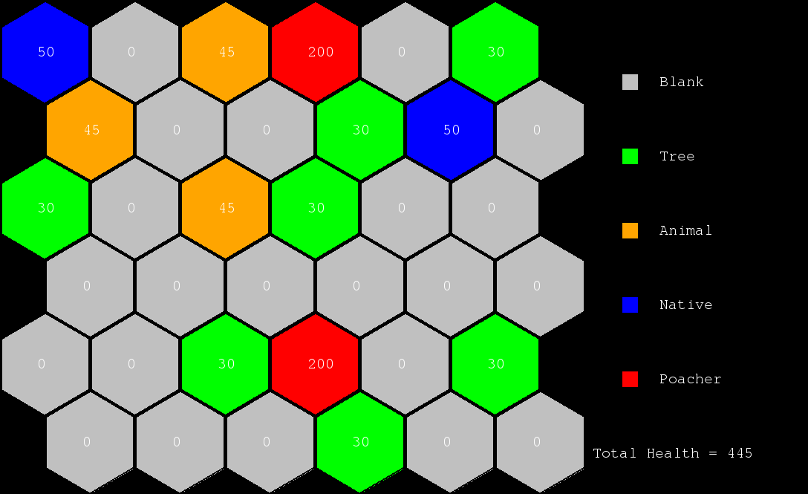

## Protect Our Planet ( POP )

### Plot and Synopsis

There has been an attack on a rainforest by poachers. For thier own good, they selfishly :
* Cut down trees
* Hunt down animals

To protect our beloved nature, natives take action. Their objective is to prevent the total health of the ecological system from degrading too much. They are provided with weapons, just like their counterparts, to attack and hence inhibit the actions of the latter.

The battleground (with just 4 members!) is on a 6 X 6 board, with hexagonal cells.
The cells are given a `(x, y)` coordinate value with vertical rows and horizontal columns. A preview of the empty board is given below :

The user plays as a **native**, and has a clear motive to minimize the degradation of health of the environment. If all the *poachers* die, or a maximum number of turns have alreay been made, the game ends and the player wins. A defeat for the player is iminent when the health has decreased below he safe margin before the maximum number of turns is reached.

### Tools Used

The game has been implemented purely in python2. The logic and AI has been implemented in `pop.py`. The user interface has been implemented in `pygame`, which resides in file `pop_ui.py`. For proper execution of the game, python, with its minimal packages, and pygame has to be installed in the system.

### Controls
The only controls used for user interaction with the game environment is mouse click. A `left mouse click` on a hex cell is interpreted as one of the `hot cells`. The first hot cell is the `starting position`, the second is the `target position`. A start-end pair is taken as an input from the user at every turn, and an attempt to play this move is made.

### Brief Game Rules

* The board is a `6 X 6` hex-grid.
* There are four kinds of characters : `(Tree, Animal, Native, Poacher)` on the board.
* A valid movement of a mobile character is from a hex-cell to any of the adjacent hex-cells sharing a common edge.
* The board is randomly initialized with `7` trees, `3` animals, `2` natives and `2` poachers. All other cells are empty.
* The total health of the system is a measure of how balanced the ecology is. Attack on any character causes a decrease in health point for the character, and hence the total health of the system decreases, except for the poachers.
* Trees heal natives at adjacent cells, and increase their corresponding health point.
* Animals attack the mobile characters (natives and poachers) at adjacent cells and decrease their corresponding health point.
* Both natives and poachers can attack any other character, except their own kin, at 2 valid moves away. The attack of native on plants and animals is highly discouraged, however, since it kills them in one shot, and affects the environment heavily.
* The initial health of the characters are :
  - tree --> `30`
  - animal --> `45`
  - native --> `50`
  - poacher --> `100`
* Tree heals :
  - native --> `+5`
* Animal attacks :
  - native --> `-15`
  - poacher --> `-20`
* Native can attack :
  - poacher --> `-10`
  - tree --> `-30`
  - animal --> `-50`
* Poachers can attack :
  - native --> `-15`
  - tree --> `-15`
  - animal --> `-20`
* The *safe level* of health is an aggregate of 200 health points.
* The maximum number of turns played is 20.
* The game ends with a win for the player, if maximum number of turns has been made and the total health has not decreased below a certain limit or both the poachers are dead.
* The game ends with a loss for the player, if the total health of the environment goes below  the *safe level*.

### AI Implementation
* The core of the AI is a variance of minimax (maximax, if we go by the name). Since the game is not zero-sum, this has to be applied.
* A board position is evaluated (given a score) on the basis of the possible movements for the concerned character and threats to the same. A tentative score is given by taking into account the attack on each poacher (native) by surrounding animals and natives (poachers), and the healing effect of the trees on natives.

### Character Placement
Since the board is randomly initialized, there is no fixed character placement. However, the cardinal numbers of each of the characters is fixed:  `7` trees, `3` animals, `2` natives and `2` poachers. A board generated randomly looks like this :

#### Colour as legend
| Colour | Character Type |
| ------ | --------------:|
| Silver | Empty Cell     |
| Green  | Plant          |
| Orange | Animal         |
| Blue   | Native         |
| Red    | Pacher         |

### Character Movement
* A valid move of a character is from the cell where it's present to any of the empty adjacent cells, i.e., cells which share a common edge (and are inside the board).
* Both natives and poachers can attack characters of other type, which are at most 2 moves (distance) away. This decreases the health of the character there. Also, if the attacked character loses its health completely and is present at an adjacent cell, the attacker moves directly into the cell.

### Character Animantion
* There is not much animation in the game, as of now. The only movement, which might seem to be animation, is the spontaneous movement of the characters from one cell to another.

### Instructions
* To start terminal based game, run the file `pop.py` with python2. From project's root folder run:
`python2 ./pop.py`
* To start the more interactive ui version of the game, run `pop_ui.py`. From the root folder of the project run:
`python2 ./pop_ui.py`.
